# Employee Metrics Dashboard - Design Document

## Executive Summary

This document outlines the design for a comprehensive Employee Metrics Dashboard that provides visualization and tracking of KPIs (Key Performance Indicators) at individual, scrum team, and organizational team levels. The dashboard will support customizable KPI selection, ROG (Red-Orange-Green) status tracking, and drill-down capabilities.

---

## 1. Technology Stack

### 1.1 Frontend Framework
**Selected: React + TypeScript**
- **Why:** Industry-standard, component-based architecture, excellent for complex UIs
- **TypeScript:** Type safety for large-scale applications
- **State Management:** Zustand (lightweight) or Redux Toolkit

### 1.2 UI Component Library
**Selected: Material-UI (MUI) v5**
- **Why:** 
  - Comprehensive component library with professional design
  - Built-in theming and responsive design
  - Excellent data grid and visualization components
  - Active community and regular updates
  - MIT License (truly open source)

### 1.3 Data Visualization
**Selected: Apache ECharts**
- **Why:**
  - Powerful, flexible charting library
  - Better performance than Chart.js for large datasets
  - Rich interactive features
  - MIT License
  - Excellent gauge charts for ROG indicators

**Alternative Components:**
- **Recharts:** For simpler, React-native charts
- **Nivo:** For beautiful, responsive visualizations

### 1.4 Data Grid
**Selected: MUI X Data Grid (Community Edition)**
- **Why:**
  - Advanced filtering, sorting, pagination
  - Row selection and export capabilities
  - Integrates seamlessly with MUI
  - MIT License for community edition

### 1.5 Backend Framework
**Selected: FastAPI (Python)**
- **Why:**
  - High performance, async support
  - Automatic API documentation (Swagger/OpenAPI)
  - Easy integration with existing Python KPI scripts
  - Type hints and validation with Pydantic
  - MIT License

### 1.6 Data Storage
**Selected: CSV Files (Current System)**
- **Why:**
  - Already generating all KPI data in CSV format
  - No database management overhead
  - Simple deployment and backup
  - Easy data inspection and debugging
  - Works perfectly with pandas (already in use)
  - Version control friendly (git-trackable)

**Data Loading Strategy:**
- Load CSV files on-demand or cache in memory
- Use pandas DataFrames for fast querying and aggregation
- Optional: Redis for caching frequently accessed data

### 1.7 Data Processing & Refresh Strategy
**Selected: Pandas + NumPy (already in use)**
- Leverage existing KPI calculation scripts
- FastAPI endpoints will call existing KPI modules

**Data Refresh Strategy:**
- **File Watcher:** Monitor CSV files for changes (using `watchdog` library)
- **Auto-reload:** Reload DataFrames when CSV files are modified
- **Refresh Frequencies:**
  - Hourly KPIs: Check for updates every hour
  - Daily KPIs: Check for updates once per day
  - On-demand: Manual refresh button in UI
- **Cache TTL:** Set based on KPI update frequency
- **Last Modified Tracking:** Store file modification timestamps to avoid unnecessary reloads

### 1.8 Authentication & Authorization
**Selected: OAuth 2.0 / JWT**
- FastAPI Security utilities
- Role-based access control (RBAC)

- **No Mobile App:** Responsive web design for mobile browsers (no React Native needed)
### 1.9 Development & Build Tools
- **Build Tool:** Vite (fast, modern)
- **Package Manager:** npm or pnpm
- **Linting:** ESLint + Prettier
- **Testing:** Jest + React Testing Library
- **PDF Export:** 
  - Backend: `weasyprint` (Python) or `reportlab`
  - Frontend: `jsPDF` + `html2canvas` for client-side generation
  - Alternative: Puppeteer for high-quality PDF rendering
- **Excel Export:**
  - Backend: `openpyxl` (Python) for Excel generation with conditional formatting
  - Frontend: `xlsx` (SheetJS) for client-side Excel generation
- **CSV Export:** Native Python `csv` module or pandas `to_csv()`

### 1.10 Deployment Options
- **Docker & Docker Compose:** Containerization
- **Nginx:** Reverse proxy and static file serving
- **CI/CD:** GitHub Actions (already using GitHub)

---

## 2. Architecture Overview

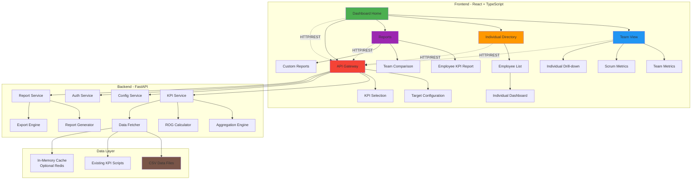

---

## 3. Data Model (CSV-Based)

### 3.1 Existing CSV Files (Already Available)

```
config/
  ├── Resources.csv          # Employee master data
  │   Columns: SAPID, Name, Team, Scrum, Primary Role, Secondary Role, Manager, etc.
  │
  └── Roles.csv              # KPI definitions and targets
      Columns: Index, Role, KPP Goals, Aggregation Type, Weekly Target, 
               Quarterly Target, Annual Target, Goal Type, etc.

output/
  ├── k3-data.csv            # Story Points KPI data
  ├── k12-data.csv           # Code Review KPI data
  ├── k56-data.csv           # Screens Developed KPI data
  ├── ... (all KPI data files)
  │   Common Columns: CurrentDate, Week, Month, Quarter, Year, SAPID, Name,
  │                   Weekly, Monthly, Quarterly, Annual
  │
  ├── JIRAIssues.csv         # JIRA data (if needed)
  └── github_commits.csv     # GitHub data (if needed)
```

### 3.2 Additional CSV Files for Dashboard

```
config/
  ├── kpi_active.csv         # KPI selection configuration
  │   Columns: kpi_id, is_active, modified_by, modified_date
  │
  ├── target_overrides.csv   # Individual target overrides (optional)
  │   Columns: sapid, kpi_id, weekly_target, quarterly_target, 
  │            annual_target, effective_from, effective_to
  │
  ├── kpi_refresh_schedule.csv  # KPI refresh configuration
  │   Columns: kpi_id, refresh_frequency (hourly/daily), last_generated,
  │            script_path, auto_generate
  │
  └── rog_thresholds.csv     # ROG threshold configuration
      Columns: threshold_name, value, description
      Default values: green_min=0.62, orange_min=0.40, red_max=0.40

cache/ (optional)
  ├── rog_cache.csv          # Pre-calculated ROG status (for performance)
  │   Columns: sapid,& Refresh Strategy

```mermaid
flowchart TB
    A[CSV Files on Disk] --> B[FastAPI Startup]
    B --> C[Load into Pandas DataFrames]
    C --> D[Store in Memory Cache with TTL]
    D --> E[API Endpoints Query Cache]
    
    F[File Watcher<br/>watchdog] -.Monitor Changes.-> A
    F -.Trigger Reload.-> C
    
    G[Scheduled Tasks<br/>APScheduler] --> H{Check Refresh Schedule}
    H -->|Hourly KPIs| I[Check Last Modified]
    H -->|Daily KPIs| J[Check Last Modified]
    
    I --> K{File Changed?}
    J --> K
    K -->|Yes| C
    K -->|No| L[Skip Reload]
    
    M[Manual Refresh Button<br/>in UI] -.Force Reload.-> C
    
    style A fill:#FFF9C4
    style D fill:#C8E6C9
    style E fill:#BBDEFB
    style F fill:#FFE0B2
    style G fill:#E1BEE7s Query Cache]
    E --> F[Auto-refresh on CSV Update]
    
    G[File Watcher] -.Monitor.-> A
    G -.Trigger Reload.-> B
    
    style A fill:#FFF9C4
    style D fill:#C8E6C9
    style E fill:#BBDEFB
```

### 3.2 Aggregation Type Rules

| Aggregation Type | Formula | Comparison Logic | ROG Status (Configurable) |
|------------------|---------|------------------|---------------------------|
| **ANG** | SUM(individual_values) | actual ≥ target | Green: ≥62%, Orange: 40-62%, Red: ≤40% |
| **ANL** | SUM(individual_values) | actual ≤ target | Green: ≤100%, Orange: 100-162%, Red: >162% |
| **NA** | No aggregation | No comparison | Individual only, no ROG |
| **APG** | Team level % (no aggregation) | actual ≥ target | Green: ≥62%, Orange: 40-62%, Red: ≤40% |
| **APL** | Team level % (no aggregation) | actual ≤ target | Green: ≤100%, Orange: 100-162%, Red: >162% |

**Note:** ROG thresholds are configurable via `config/rog_thresholds.csv`. Default thresholds:
- **Green:** ≥62% of target (for ANG/APG) or ≤100% of target (for ANL/APL)
- **Orange:** 40-62% of target (for ANG/APG) or 100-162% of target (for ANL/APL)
- **Red:** ≤40% of target (for ANG/APG) or >162% of target (for ANL/APL)

### 3.3 Goal Type Groups

Based on the Roles.csv data:
- **Input:** Learning, training, skill development KPIs
- **Output:** Deliverables, features, story points, bugs detected
- **Quality:** Code quality, test coverage, bug resolution
- **Hygiene:** Process compliance, documentation, reviews

---

## 4. User Interface Design

### 4.1 Dashboard Home / Navigation

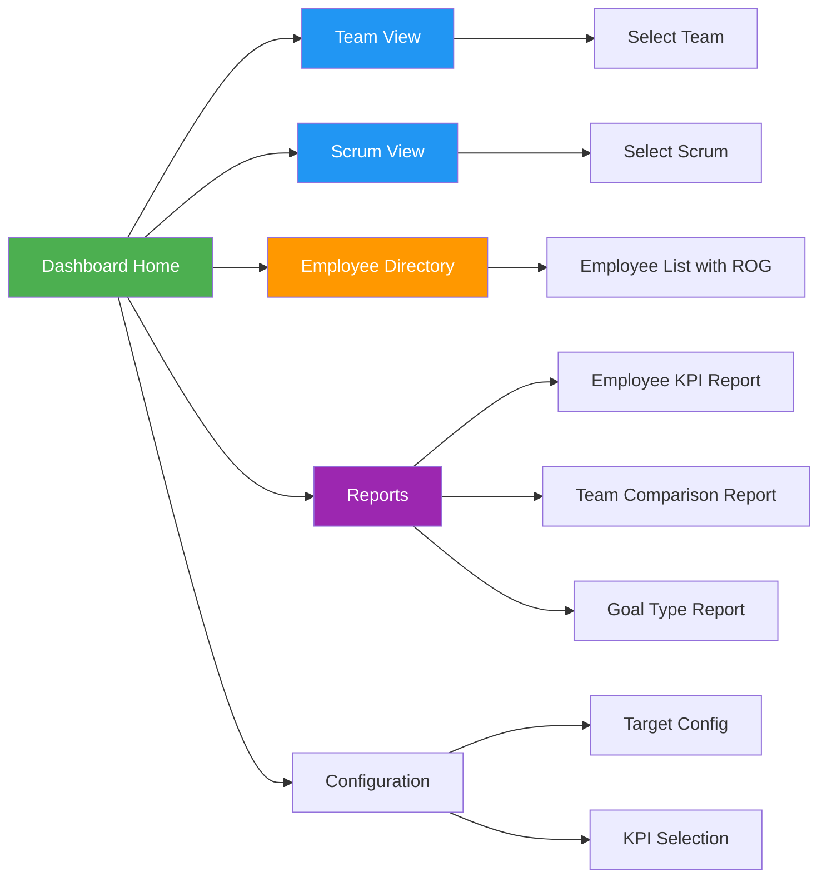

### 4.2 Screen Mockups (Mermaid Format)

#### 4.2.1 Home Dashboard

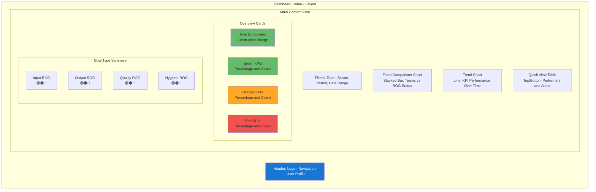

#### 4.2.2 Team/Scrum View Page

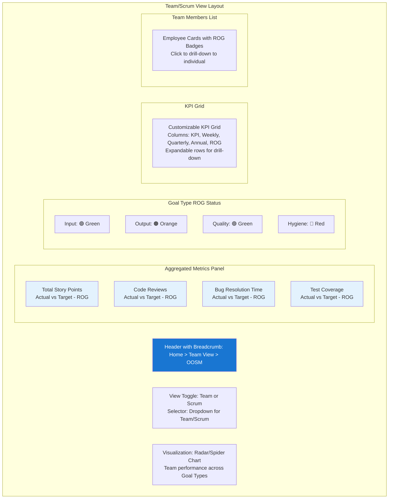

#### 4.2.3 Individual Employee Dashboard

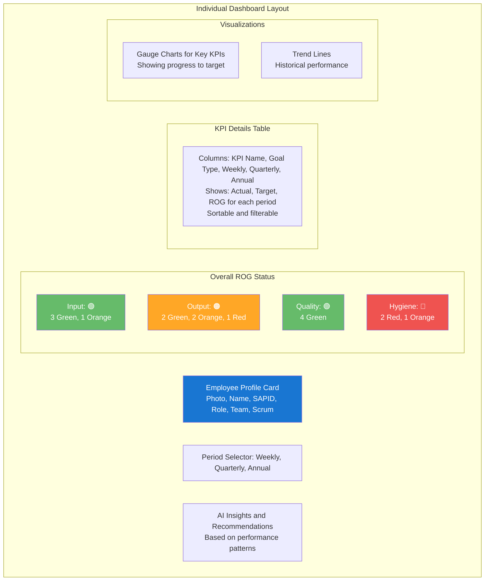

#### 4.2.4 Employee Directory Page

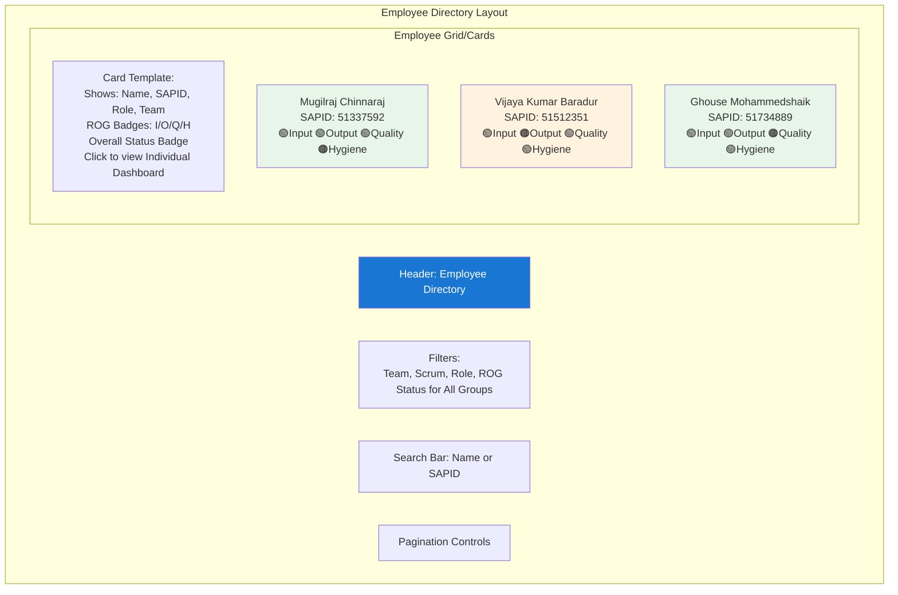

#### 4.2.5 Target Configuration Page

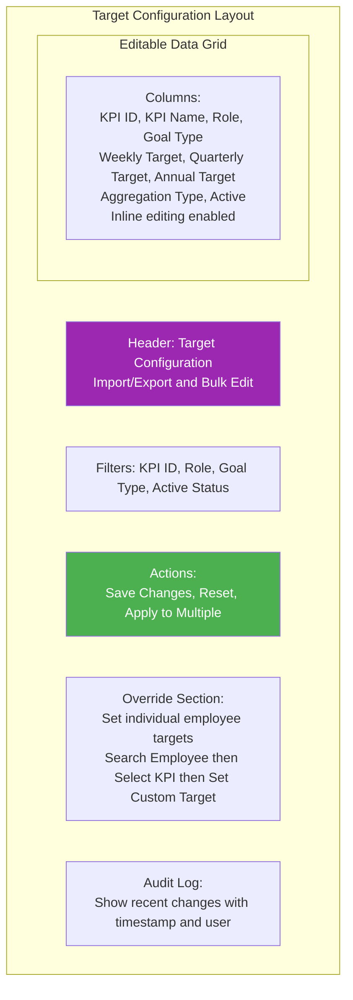

#### 4.2.6 KPI Selection Configuration Page

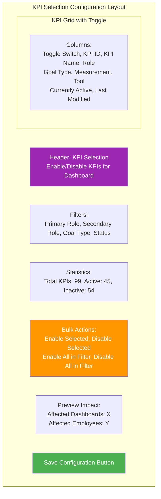

#### 4.2.7 Employee Management Screen (Admin Only)

**Purpose:** Manage employee master data (Resources.csv) with role assignment, bulk import, and template download.

**Layout:**
```mermaid
graph TD
    A[Employee Management Screen] --> B[Action Bar]
    A --> C[Employee Data Grid]
    A --> D[Add/Edit Dialog]
    
    B --> B1[+ Add Employee Button]
    B --> B2[Import CSV Button]
    B --> B3[Download Template Button]
    B --> B4[Export Current Data Button]
    B --> B5[Search/Filter Controls]
    
    C --> C1[Columns: SAPID - Name - Team - Scrum - Primary Role - Secondary Role - Manager - Actions]
    C --> C2[Edit Icon Button per row]
    C --> C3[Delete Icon Button per row]
    C --> C4[Pagination 50 rows per page]
    C --> C5[Sort by any column]
    C --> C6[Filter by Team/Scrum/Role]
    
    D --> D1[Form Fields: SAPID Text - Name Text - Team Dropdown - Scrum Dropdown]
    D --> D2[Primary Role Dropdown from Roles.csv]
    D --> D3[Secondary Role Dropdown from Roles.csv]
    D --> D4[Manager Autocomplete SAPID or Name]
    D --> D5[Save Button - Cancel Button]
    D --> D6[Validation: SAPID unique - All fields required except Secondary Role]
```

**Key Features:**

1. **Employee Data Grid:**
   - Displays all employees from Resources.csv
   - Inline edit/delete actions per row
   - Search across SAPID, Name, Team, Scrum
   - Filter by Team, Scrum, Primary Role, Secondary Role
   - Sort by any column
   - Pagination (50 rows per page)
   - Export current view to CSV

2. **Add/Edit Employee Dialog:**
   - **SAPID:** Text field (unique, 8 digits)
   - **Name:** Text field (required)
   - **Team:** Dropdown with existing teams + "Add New" option
   - **Scrum:** Dropdown with existing scrums + "Add New" option
   - **Primary Role:** Dropdown populated from Roles.csv ("Primary Role" column)
   - **Secondary Role:** Dropdown populated from Roles.csv ("Secondary Role" column) - Optional
   - **Manager:** Autocomplete search by SAPID or Name from existing employees
   - Validation:
     - SAPID must be unique (8 digits)
     - Name, Team, Scrum, Primary Role required
     - Secondary Role optional
     - Manager must exist in Resources.csv

3. **Bulk Import:**
   - Click "Import CSV" button
   - File picker dialog (accepts .csv only)
   - Preview table shows first 10 rows with validation status
   - Validation rules:
     - SAPID must be unique
     - Primary Role must exist in Roles.csv
     - Secondary Role (if provided) must exist in Roles.csv
     - Manager SAPID (if provided) must exist in Resources.csv
   - Row-level validation indicators (✓ green, ✗ red with error message)
   - Options:
     - **Import Mode:** "Add new only" or "Update existing" or "Add + Update"
     - **On Duplicate:** "Skip" or "Overwrite"
   - Confirm button imports all valid rows
   - Summary report: X rows imported, Y skipped, Z errors

4. **Template Download:**
   - Click "Download Template" button
   - Generates CSV file with:
     - Headers: SAPID, Name, Team, Scrum, Primary Role, Secondary Role, Manager
     - Sample rows (2-3 examples with realistic data)
     - Comments row explaining each field
   - Includes list of valid roles as separate sheet or comment
   - Template filename: `employee_import_template_YYYYMMDD.csv`

5. **Role Dropdowns:**
   - Populated dynamically from Roles.csv:
     - **Primary Role options:** Unique values from "Primary Role" column
     - **Secondary Role options:** Unique values from "Secondary Role" column
   - Dropdown shows role name with count of associated KPIs
   - Example: "Feature Owner (12 KPIs)"
   - Roles sorted alphabetically
   - "None" option for Secondary Role

6. **Data Validation:**
   - **On Save (Individual):**
     - Check SAPID uniqueness
     - Validate role exists in Roles.csv
     - Validate manager exists in Resources.csv
     - Show error message if validation fails
   - **On Import (Bulk):**
     - Validate each row independently
     - Show validation report before import
     - Allow partial import (only valid rows)

7. **Audit Trail:**
   - Log all changes to Resources.csv:
     - Timestamp, User, Action (Add/Edit/Delete/Import), SAPID, Changes
   - Store in `data/resources_audit.csv`
   - Display "Last Modified" column in grid

**User Flows:**

1. **Add New Employee:**
   - Admin clicks "+ Add Employee"
   - Dialog opens with empty form
   - Admin fills in SAPID, Name, Team, Scrum, Primary Role, (optional) Secondary Role, Manager
   - Primary/Secondary Role dropdowns show options from Roles.csv
   - Click "Save" → Validation → Append to Resources.csv → Refresh grid

2. **Edit Existing Employee:**
   - Admin clicks Edit icon on row
   - Dialog opens pre-filled with employee data
   - Admin modifies fields (Role dropdowns show current selection + other options from Roles.csv)
   - Click "Save" → Validation → Update Resources.csv → Refresh grid

3. **Bulk Import:**
   - Admin clicks "Import CSV"
   - Selects file from computer
   - System validates all rows against Roles.csv and existing employees
   - Preview table shows validation status per row
   - Admin selects import mode and duplicate handling
   - Click "Import" → Process valid rows → Show summary report → Refresh grid

4. **Download Template:**
   - Admin clicks "Download Template"
   - Browser downloads `employee_import_template_YYYYMMDD.csv`
   - Admin opens in Excel/Google Sheets
   - Template includes headers, sample data, and validation notes
   - Template lists all valid roles from Roles.csv in a comment or separate section

**Security:**
- Only Admin role can access this screen
- All actions logged to audit trail
- Backup Resources.csv before bulk import
- Rollback mechanism if import fails mid-process

---

#### 4.2.8 Role Management Screen (Admin Only)

**Purpose:** Manage KPI roles and targets (Roles.csv) with focus on UI-based target editing and CSV import for bulk changes.

**Layout:**
```mermaid
graph TD
    A[Role Management Screen] --> B[Action Bar]
    A --> C[Roles Data Grid]
    A --> D[Edit Targets Dialog]
    
    B --> B1[Import Roles CSV Button]
    B --> B2[Download Template Button]
    B --> B3[Export Current Data Button]
    B --> B4[Search/Filter Controls]
    
    C --> C1[Columns: Index KPI - Name - Primary Role - Secondary Role - Goal Type]
    C --> C2[Weekly Target - Quarterly Target - Annual Target - Editable]
    C --> C3[Aggregation Type - Active Status]
    C --> C4[Edit Targets Icon Button per row]
    C --> C5[Pagination 50 rows per page]
    C --> C6[Sort by any column]
    C --> C7[Filter by Role/Goal Type/Active]
    C --> C8[Inline target editing or click row]
    
    D --> D1[KPI ID and Name Display]
    D --> D2[Primary Role Secondary Role Display]
    D --> D3[Weekly Target Input Editable]
    D --> D4[Quarterly Target Input Editable]
    D --> D5[Annual Target Input Editable]
    D --> D6[Save Button - Cancel Button]
    D --> D7[Copy targets from another role option]
```

**Key Features:**

1. **Roles Data Grid:**
   - Displays all KPIs from Roles.csv (99 rows)
   - **Inline Target Editing**: Click target cell to edit directly in grid
   - **Bulk Selection**: Select multiple rows to update targets together
   - Search across KPI Index, Name, Role
   - Filter by Primary Role, Secondary Role, Goal Type, Active Status
   - Sort by any column
   - Pagination (50 rows per page)
   - Color-coded by Goal Type (Input=Blue, Output=Green, Quality=Purple, Hygiene=Orange)
   - Export current view to CSV

2. **Target Editing (Primary UI Feature):**
   - **Inline Editing**: Double-click any target cell (Weekly/Quarterly/Annual) to edit
   - **Edit Dialog**: Click "Edit" icon for focused editing of one KPI's targets
   - **Bulk Edit**: Select multiple rows → "Edit Targets" → Apply same values to all
   - **Copy Targets**: "Copy from Role" dropdown to replicate targets from another role
   - **Smart Validation**:
     - Targets must be numeric (allow decimals)
     - Quarterly = 13 × Weekly (auto-calculate suggestion)
     - Annual = 4 × Quarterly (auto-calculate suggestion)
     - Warning if relationships don't match
   - **Auto-save**: Changes saved immediately on blur/Enter (with undo option)
   - **Bulk Update**: "Apply to All {Role}" button to set same targets for all KPIs of a role

3. **Edit Targets Dialog:**
   - **KPI Details** (read-only): Index, Name, Primary Role, Secondary Role, Goal Type
   - **Target Inputs**:
     - Weekly Target (editable)
     - Quarterly Target (editable, with "Auto" button = Weekly × 13)
     - Annual Target (editable, with "Auto" button = Quarterly × 4)
   - **Copy Targets**: Dropdown to select another role/KPI to copy targets from
   - **History**: Show last 5 changes to this KPI's targets
   - **Preview**: Show how this change affects X employees
   - **Save** → Update Roles.csv → Refresh grid

4. **Bulk Import (for non-target fields):**
   - Click "Import Roles CSV" button
   - File picker dialog (accepts .csv only)
   - Preview table shows first 10 rows with validation status
   - Validation rules:
     - Index (KPI ID) must be unique
     - Primary Role, Secondary Role must be valid role names
     - Goal Type must be: Input, Output, Quality, or Hygiene
     - Aggregation Type must be: ANG, ANL, APG, APL, or NA
     - Targets must be numeric
   - Row-level validation indicators (✓ green, ✗ red with error message)
   - Options:
     - **Import Mode**: "Replace all" or "Update existing" or "Add new only"
     - **Target Handling**: "Keep existing targets" or "Update targets from file"
   - Confirm button imports all valid rows
   - Summary report: X rows imported, Y skipped, Z errors

5. **Template Download:**
   - Click "Download Template" button
   - Generates CSV file with:
     - Headers: Index,Name,Primary Role,Secondary Role,Goal Type,Weekly Target,Quarterly Target,Annual Target,Aggregation Type,Active
     - Sample rows (3-5 examples covering different goal types)
     - Comments explaining each field
   - Template filename: `roles_import_template_YYYYMMDD.csv`

6. **Bulk Target Operations:**
   - **Select Multiple Rows**: Checkbox column for multi-select
   - **Bulk Actions Toolbar** (appears when rows selected):
     - "Set Targets" → Dialog to enter Weekly/Quarterly/Annual → Apply to all selected
     - "Scale Targets" → Enter percentage (e.g., 110% to increase by 10%)
     - "Copy Targets From" → Select a source KPI → Copy its targets to selected
     - "Reset to Defaults" → Restore original targets from backup
   - **Role-Based Bulk Edit**: "Edit All {Role} Targets" button to update all KPIs for a specific role

7. **Data Validation:**
   - **On Save (Individual)**:
     - Targets must be positive numbers
     - Warning if Quarterly ≠ Weekly × 13
     - Warning if Annual ≠ Quarterly × 4
     - Confirm if change affects many employees
   - **On Import (Bulk)**:
     - Validate each row independently
     - Show validation report before import
     - Allow partial import (only valid rows)
     - Backup Roles.csv before import

8. **Audit Trail:**
   - Log all changes to Roles.csv:
     - Timestamp, User, Action (Edit/Import/BulkEdit), KPI Index, Old/New Values
   - Store in `data/roles_audit.csv`
   - Display "Last Modified" column in grid
   - View change history per KPI

9. **Impact Analysis:**
   - When editing targets, show impact:
     - "This KPI applies to 45 employees"
     - "15 employees will change from Green to Orange status"
   - Warning before saving if high impact

**User Flows:**

1. **Edit Target (Inline):**
   - Admin double-clicks target cell in grid
   - Cell becomes editable input
   - Admin types new value
   - Press Enter or click outside → Validation → Update Roles.csv → Show success

2. **Edit Target (Dialog):**
   - Admin clicks "Edit" icon on row
   - Dialog opens showing KPI details and current targets
   - Admin modifies Weekly/Quarterly/Annual targets
   - Optional: Click "Auto" to calculate Quarterly (Weekly × 13) and Annual (Quarterly × 4)
   - Optional: Select "Copy from" to replicate another role's targets
   - Click "Save" → Validation → Show impact → Update Roles.csv → Refresh grid

3. **Bulk Edit Targets:**
   - Admin selects multiple rows (checkboxes)
   - Bulk Actions Toolbar appears
   - Admin clicks "Set Targets"
   - Dialog opens with Weekly/Quarterly/Annual inputs
   - Admin enters values
   - Click "Apply" → Validation → Update Roles.csv for all selected → Refresh grid

4. **Bulk Import (Full Roles Update):**
   - Admin clicks "Import Roles CSV"
   - Selects file from computer
   - System validates all rows
   - Preview table shows validation status per row
   - Admin selects import mode and target handling
   - Click "Import" → Backup Roles.csv → Process valid rows → Show summary report → Refresh grid

5. **Download Template:**
   - Admin clicks "Download Template"
   - Browser downloads `roles_import_template_YYYYMMDD.csv`
   - Template includes headers, sample data, and field explanations

6. **Role-Based Bulk Update:**
   - Admin filters grid by "Primary Role = Developer"
   - Clicks "Edit All Developer Targets" button
   - Dialog opens with target inputs
   - Admin enters new targets (e.g., increase all by 20%)
   - Click "Apply" → Update all Developer KPIs → Show summary

**Security:**
- Only Admin role can access this screen
- All actions logged to audit trail
- Backup Roles.csv before any bulk operation
- Rollback mechanism if import fails mid-process
- Impact warning for changes affecting >20 employees

**Performance Considerations:**
- Auto-save debounced (500ms) for inline editing
- Pagination to handle 99 KPIs efficiently
- Impact analysis calculated on-demand (cached for 60s)

---

## 5. API Endpoints Design

### 5.1 KPI Data Endpoints

```
GET  /api/kpi/values
     ?sapid={sapid}&period={weekly|quarterly|annual}&date={YYYY-MM-DD}
     Returns KPIs applicable to employee based on their Primary/Secondary Role
     
GET  /api/kpi/applicable
     ?sapid={sapid}
     Returns list of KPIs applicable to this employee based on roles
     
GET  /api/kpi/aggregated
     ?level={team|scrum}&name={team_name}&period={weekly|quarterly|annual}
     
GET  /api/kpi/rog-status
     ?sapid={sapid}&goal_type={Input|Output|Quality|Hygiene}
     
GET  /api/kpi/definitions
     ?role={role}&goal_type={goal_type}&active={true|false}
```

### 5.2 Configuration Endpoints

```
GET    /api/config/targets
POST   /api/config/targets
PUT    /api/config/targets/{kpi_id}
DELETE /api/config/targets/{kpi_id}

GET    /api/config/kpi-selection
PUT    /api/config/kpi-selection/toggle
POST   /api/config/kpi-selection/bulk

GET    /api/config/refresh-schedule
PUT    /api/config/refresh-schedule/{kpi_id}

GET    /api/config/rog-thresholds
PUT    /api/config/rog-thresholds
     Body: { green_min, orange_min, red_max }
```

### 5.3 Employee & Team Endpoints

```
GET  /api/employees
     ?team={team}&scrum={scrum}&role={role}
     
GET  /api/employees/{sapid}

GET  /api/employees/{sapid}/subordinates
     Get all subordinates in hierarchy (not just direct reports)
     ?include_indirect={true|false}

GET  /api/teams

GET  /api/scrums
```

### 5.4 ROG Calculation Endpoint

```
POST /api/calculate/rog
     Body: { sapid, kpi_id, period, actual_value, target_value }
     
GET  /api/calculate/goal-type-rog
     ?sapid={sapid}&goal_type={goal_type}&period={period}
```

### 5.5 Data Refresh Endpoints

```
POST /api/refresh/all
     Trigger reload of all CSV files
     
POST /api/refresh/kpi/{kpi_id}
     Trigger reload of specific KPI data
     
GET  /api/refresh/status
     Get last refresh times and next scheduled refresh
     
GET  /api/refresh/schedule
     Get refresh schedule for all KPIs
```

### 5.6 Export Endpoints

```
POST /api/export/dashboard/pdf
     Body: { sapid, period, include_charts }
     Returns: PDF file of individual dashboard
     
POST /api/export/team/pdf
     Body: { team, scrum, period, include_members }
     Returns: PDF file of team/scrum dashboard
     
GET  /api/export/kpi/{kpi_id}/csv
     Export specific KPI data as CSV
     
POST /api/export/custom
     Body: { report_type, filters, format }
     Returns: Custom export (PDF or CSV)
```

### 5.7 Report Endpoints

```
GET  /api/reports/employee-kpi
     ?team={team}&scrum={scrum}&period={weekly|quarterly|annual}
     &kpi_ids={k3,k12,k56}&date={YYYY-MM-DD}
     Returns: Employee KPI Report data with ROG colors
     
GET  /api/reports/team-comparison
     ?teams={team1,team2}&period={period}&goal_type={goal_type}
     Returns: Comparison report across teams
     
GET  /api/reports/goal-type-summary
     ?level={team|scrum|organization}&period={period}
     Returns: Summary by goal type groups
     
POST /api/reports/custom
     Body: { dimensions, metrics, filters, group_by }
     Returns: Custom report based on specifications
     
POST /api/reports/export
     Body: { report_type, filters, format }
     Returns: Exported report file (PDF, Excel, CSV)
```
Applicability Logic

**KPIs are automatically assigned based on employee roles:**

```python
def get_applicable_kpis(employee: dict, roles_df: pd.DataFrame) -> list:
    """
    Determine which KPIs apply to an employee based on their roles
    
    Logic:
    1. Get employee's Primary Role and Secondary Role from Resources.csv
    2. Get all KPIs from Roles.csv where Role matches either Primary or Secondary
    3. Filter by is_active status from kpi_active.csv
    4. Return list of applicable KPI IDs
    """
    primary_role = employee['Primary Role']
    secondary_role = employee['Secondary Role']
    
    # Get KPIs for primary role
    primary_kpis = roles_df[roles_df['Role'] == primary_role]['Index'].tolist()
    
    # Get KPIs for secondary role
    secondary_kpis = roles_df[roles_df['Role'] == secondary_role]['Index'].tolist()
    
    # Also include "All" role KPIs that apply to everyone
    all_kpis = roles_df[roles_df['Role'] == 'All']['Index'].tolist()
    
    # Combine and deduplicate
    applicable_kpis = list(set(primary_kpis + secondary_kpis + all_kpis))
    
    return applicable_kpis

# Example:
# Employee: Mugilraj Chinnaraj
# Primary Role: Feature Owner
# Secondary Role: Security Engineer
# Applicable KPIs: k3, k5, k13, k14, k35, k36, k37, k38, etc.
```

### 6.2 KPI 
---

### 5.8 Employee Management Endpoints (Admin Only)

#### GET /api/employees
Fetch all employees with filtering and pagination.

**Query Parameters:**
- `team` (optional): Filter by team
- `scrum` (optional): Filter by scrum
- `primary_role` (optional): Filter by primary role
- `secondary_role` (optional): Filter by secondary role
- `search` (optional): Search in SAPID or Name
- `page` (default: 1): Page number
- `page_size` (default: 50): Rows per page
- `sort_by` (default: "Name"): Column to sort by
- `sort_order` (default: "asc"): "asc" or "desc"

**Response:**
```json
{
  "data": [
    {
      "sapid": "51337592",
      "name": "Mugilraj Chinnaraj",
      "team": "DCEM",
      "scrum": "Team DCEM",
      "primary_role": "Feature Owner",
      "secondary_role": "Security Engineer",
      "manager": "50123456",
      "manager_name": "John Smith",
      "last_modified": "2026-03-01T10:30:00Z",
      "last_modified_by": "admin@company.com"
    }
  ],
  "total": 150,
  "page": 1,
  "page_size": 50,
  "total_pages": 3
}
```

#### GET /api/employees/{sapid}
Fetch single employee by SAPID.

**Response:**
```json
{
  "sapid": "51337592",
  "name": "Mugilraj Chinnaraj",
  "team": "DCEM",
  "scrum": "Team DCEM",
  "primary_role": "Feature Owner",
  "secondary_role": "Security Engineer",
  "manager": "50123456",
  "manager_name": "John Smith",
  "kpi_count": 18,
  "last_modified": "2026-03-01T10:30:00Z"
}
```

#### POST /api/employees
Create new employee.

**Request Body:**
```json
{
  "sapid": "51999888",
  "name": "Jane Doe",
  "team": "Platform",
  "scrum": "Team Alpha",
  "primary_role": "Developer",
  "secondary_role": "Security Engineer",
  "manager": "50123456"
}
```

**Response:**
```json
{
  "success": true,
  "message": "Employee created successfully",
  "data": {
    "sapid": "51999888",
    "name": "Jane Doe",
    "team": "Platform",
    "scrum": "Team Alpha",
    "primary_role": "Developer",
    "secondary_role": "Security Engineer",
    "manager": "50123456",
    "kpi_count": 15
  }
}
```

**Validation Errors (400):**
```json
{
  "success": false,
  "errors": [
    {
      "field": "sapid",
      "message": "SAPID 51999888 already exists"
    },
    {
      "field": "primary_role",
      "message": "Role 'InvalidRole' not found in Roles.csv"
    },
    {
      "field": "manager",
      "message": "Manager SAPID 50999999 not found"
    }
  ]
}
```

#### PUT /api/employees/{sapid}
Update existing employee.

**Request Body:**
```json
{
  "name": "Jane Doe-Smith",
  "team": "Platform",
  "scrum": "Team Beta",
  "primary_role": "Tech Lead",
  "secondary_role": null,
  "manager": "50123456"
}
```

**Response:**
```json
{
  "success": true,
  "message": "Employee updated successfully",
  "data": {
    "sapid": "51999888",
    "name": "Jane Doe-Smith",
    "team": "Platform",
    "scrum": "Team Beta",
    "primary_role": "Tech Lead",
    "secondary_role": null,
    "manager": "50123456",
    "kpi_count": 12
  }
}
```

#### DELETE /api/employees/{sapid}
Delete employee (soft delete - mark as inactive).

**Response:**
```json
{
  "success": true,
  "message": "Employee 51999888 deleted successfully"
}
```

#### GET /api/employees/roles/options
Get available roles from Roles.csv for dropdowns.

**Response:**
```json
{
  "primary_roles": [
    {
      "value": "Developer",
      "label": "Developer (15 KPIs)",
      "kpi_count": 15
    },
    {
      "value": "Feature Owner",
      "label": "Feature Owner (18 KPIs)",
      "kpi_count": 18
    },
    {
      "value": "Tech Lead",
      "label": "Tech Lead (12 KPIs)",
      "kpi_count": 12
    }
  ],
  "secondary_roles": [
    {
      "value": "Security Engineer",
      "label": "Security Engineer (5 KPIs)",
      "kpi_count": 5
    },
    {
      "value": "Performance Engineer",
      "label": "Performance Engineer (3 KPIs)",
      "kpi_count": 3
    }
  ],
  "teams": ["DCEM", "Platform", "Mobile", "QA"],
  "scrums": ["Team DCEM", "Team Alpha", "Team Beta", "Team Gamma"]
}
```

#### GET /api/employees/managers/search
Search for managers (autocomplete).

**Query Parameters:**
- `q`: Search query (SAPID or Name)

**Response:**
```json
{
  "results": [
    {
      "sapid": "50123456",
      "name": "John Smith",
      "label": "John Smith (50123456)"
    },
    {
      "sapid": "50234567",
      "name": "Jane Johnson",
      "label": "Jane Johnson (50234567)"
    }
  ]
}
```

#### POST /api/employees/import
Bulk import employees from CSV.

**Request:**
- Content-Type: multipart/form-data
- File: CSV file
- Parameters:
  - `mode`: "add" | "update" | "add_update"
  - `on_duplicate`: "skip" | "overwrite"

**Response:**
```json
{
  "success": true,
  "summary": {
    "total_rows": 50,
    "valid_rows": 45,
    "invalid_rows": 5,
    "imported": 43,
    "skipped": 2,
    "errors": 5
  },
  "details": [
    {
      "row": 3,
      "status": "error",
      "sapid": "51888999",
      "name": "Bob Jones",
      "errors": [
        "Primary role 'InvalidRole' not found in Roles.csv"
      ]
    },
    {
      "row": 7,
      "status": "skipped",
      "sapid": "51337592",
      "name": "Mugilraj Chinnaraj",
      "reason": "Duplicate SAPID (mode: skip)"
    },
    {
      "row": 12,
      "status": "success",
      "sapid": "51777888",
      "name": "Alice Brown"
    }
  ]
}
```

#### GET /api/employees/template
Download CSV template for bulk import.

**Response:**
- Content-Type: text/csv
- Content-Disposition: attachment; filename="employee_import_template_20260309.csv"
- Body:
```csv
SAPID,Name,Team,Scrum,Primary Role,Secondary Role,Manager
# Sample data - Replace with your employees
51000001,John Doe,DCEM,Team DCEM,Developer,Security Engineer,50123456
51000002,Jane Smith,Platform,Team Alpha,Feature Owner,,50234567
# Valid Primary Roles: Developer, Feature Owner, Tech Lead, Architect, QA Engineer, DevOps Engineer
# Valid Secondary Roles: Security Engineer, Performance Engineer, Accessibility Engineer (or leave blank)
# Manager must be an existing SAPID from Resources.csv
```

#### POST /api/employees/validate
Validate CSV before import (preview).

**Request:**
- Content-Type: multipart/form-data
- File: CSV file

**Response:**
```json
{
  "valid": false,
  "total_rows": 10,
  "valid_rows": 8,
  "invalid_rows": 2,
  "preview": [
    {
      "row": 1,
      "sapid": "51000001",
      "name": "John Doe",
      "team": "DCEM",
      "primary_role": "Developer",
      "secondary_role": "Security Engineer",
      "manager": "50123456",
      "status": "valid",
      "errors": []
    },
    {
      "row": 3,
      "sapid": "51888999",
      "name": "Bob Jones",
      "team": "Platform",
      "primary_role": "InvalidRole",
      "secondary_role": "",
      "manager": "50999999",
      "status": "invalid",
      "errors": [
        "Primary role 'InvalidRole' not found in Roles.csv",
        "Manager SAPID 50999999 not found in Resources.csv"
      ]
    }
  ]
}
```

#### GET /api/employees/export
Export current employees to CSV.

**Query Parameters:**
- Same filters as GET /api/employees

**Response:**
- Content-Type: text/csv
- Content-Disposition: attachment; filename="employees_export_20260309.csv"
- Body: CSV file with all employees matching filters

#### GET /api/employees/audit
Get audit trail of employee changes.

**Query Parameters:**
- `sapid` (optional): Filter by employee
- `user` (optional): Filter by user who made changes
- `start_date` (optional): Filter from date
- `end_date` (optional): Filter to date
- `page`, `page_size`: Pagination

**Response:**
```json
{
  "data": [
    {
      "timestamp": "2026-03-09T14:30:00Z",
      "user": "admin@company.com",
      "action": "update",
      "sapid": "51337592",
      "employee_name": "Mugilraj Chinnaraj",
      "changes": {
        "primary_role": {
          "old": "Developer",
          "new": "Feature Owner"
        },
        "secondary_role": {
          "old": null,
          "new": "Security Engineer"
        }
      }
    },
    {
      "timestamp": "2026-03-09T10:15:00Z",
      "user": "admin@company.com",
      "action": "import",
      "summary": "Imported 45 employees"
    }
  ],
  "total": 127,
  "page": 1
}
```

---

### 5.9 Role Management Endpoints (Admin Only)

#### GET /api/roles
Fetch all roles (KPIs) with filtering and pagination.

**Query Parameters:**
- `primary_role` (optional): Filter by primary role
- `secondary_role` (optional): Filter by secondary role
- `goal_type` (optional): Filter by goal type
- `active` (optional): Filter by active status
- `search` (optional): Search in Index or Name
- `page` (default: 1): Page number
- `page_size` (default: 50): Rows per page
- `sort_by` (default: "Index"): Column to sort by
- `sort_order` (default: "asc"): "asc" or "desc"

**Response:**
```json
{
  "data": [
    {
      "index": "k3",
      "name": "Feature Implementation: Story Points",
      "primary_role": "Developer",
      "secondary_role": "All",
      "goal_type": "Output",
      "weekly_target": 4.0,
      "quarterly_target": 45.0,
      "annual_target": 180.0,
      "aggregation_type": "ANG",
      "active": true,
      "employee_count": 45,
      "last_modified": "2026-03-01T10:30:00Z",
      "last_modified_by": "admin@company.com"
    }
  ],
  "total": 99,
  "page": 1,
  "page_size": 50,
  "total_pages": 2
}
```

#### GET /api/roles/{index}
Fetch single role (KPI) by index.

**Response:**
```json
{
  "index": "k3",
  "name": "Feature Implementation: Story Points",
  "primary_role": "Developer",
  "secondary_role": "All",
  "goal_type": "Output",
  "weekly_target": 4.0,
  "quarterly_target": 45.0,
  "annual_target": 180.0,
  "aggregation_type": "ANG",
  "active": true,
  "employee_count": 45,
  "employees_affected": ["51337592", "52090140", "..."],
  "last_modified": "2026-03-01T10:30:00Z",
  "change_history": [
    {
      "timestamp": "2026-03-01T10:30:00Z",
      "user": "admin@company.com",
      "field": "quarterly_target",
      "old_value": 40.0,
      "new_value": 45.0
    }
  ]
}
```

#### PUT /api/roles/{index}/targets
Update targets for a specific role (KPI).

**Request Body:**
```json
{
  "weekly_target": 5.0,
  "quarterly_target": 65.0,
  "annual_target": 260.0
}
```

**Response:**
```json
{
  "success": true,
  "message": "Targets updated successfully",
  "data": {
    "index": "k3",
    "weekly_target": 5.0,
    "quarterly_target": 65.0,
    "annual_target": 260.0
  },
  "impact": {
    "employees_affected": 45,
    "status_changes": {
      "green_to_orange": 12,
      "orange_to_red": 5,
      "no_change": 28
    }
  },
  "warnings": [
    "Quarterly target (65) is not exactly 13× weekly (5×13=65) ✓",
    "Annual target (260) is not exactly 4× quarterly (65×4=260) ✓"
  ]
}
```

#### PUT /api/roles/bulk/targets
Update targets for multiple roles at once.

**Request Body:**
```json
{
  "kpi_indices": ["k3", "k12", "k13"],
  "weekly_target": 5.0,
  "quarterly_target": 65.0,
  "annual_target": 260.0
}
```

**Response:**
```json
{
  "success": true,
  "message": "Bulk update completed",
  "updated": 3,
  "failed": 0,
  "total_employees_affected": 78,
  "details": [
    {
      "index": "k3",
      "status": "success",
      "employees_affected": 45
    },
    {
      "index": "k12",
      "status": "success",
      "employees_affected": 38
    },
    {
      "index": "k13",
      "status": "success",
      "employees_affected": 42
    }
  ]
}
```

#### PUT /api/roles/role/{role_name}/targets
Update targets for all KPIs of a specific role.

**Request Body:**
```json
{
  "role_name": "Developer",
  "weekly_target": 5.0,
  "quarterly_target": 65.0,
  "annual_target": 260.0,
  "apply_to": "primary"  // "primary" | "secondary" | "both"
}
```

**Response:**
```json
{
  "success": true,
  "message": "Updated all Developer KPIs",
  "kpis_updated": 15,
  "employees_affected": 52,
  "updated_kpis": ["k3", "k12", "k13", "k14", "k16", "..."]
}
```

#### POST /api/roles/targets/copy
Copy targets from one KPI to others.

**Request Body:**
```json
{
  "source_index": "k3",
  "target_indices": ["k12", "k13", "k14"]
}
```

**Response:**
```json
{
  "success": true,
  "message": "Targets copied successfully",
  "source": {
    "index": "k3",
    "weekly_target": 5.0,
    "quarterly_target": 65.0,
    "annual_target": 260.0
  },
  "updated": 3
}
```

#### POST /api/roles/targets/scale
Scale targets by a percentage.

**Request Body:**
```json
{
  "kpi_indices": ["k3", "k12", "k13"],
  "scale_factor": 1.20  // 120% = increase by 20%
}
```

**Response:**
```json
{
  "success": true,
  "message": "Targets scaled by 20%",
  "updated": 3,
  "details": [
    {
      "index": "k3",
      "old_weekly": 4.0,
      "new_weekly": 4.8,
      "old_quarterly": 45.0,
      "new_quarterly": 54.0
    }
  ]
}
```

#### POST /api/roles/import
Bulk import roles from CSV.

**Request:**
- Content-Type: multipart/form-data
- File: CSV file
- Parameters:
  - `mode`: "replace" | "update" | "add"
  - `update_targets`: "true" | "false" (whether to update targets from file)

**Response:**
```json
{
  "success": true,
  "summary": {
    "total_rows": 99,
    "valid_rows": 95,
    "invalid_rows": 4,
    "imported": 95,
    "skipped": 0,
    "errors": 4
  },
  "details": [
    {
      "row": 1,
      "status": "success",
      "index": "k3",
      "name": "Feature Implementation"
    },
    {
      "row": 15,
      "status": "error",
      "index": "k999",
      "errors": [
        "Goal Type 'InvalidType' must be Input, Output, Quality, or Hygiene"
      ]
    }
  ]
}
```

#### POST /api/roles/validate
Validate CSV before import (preview).

**Request:**
- Content-Type: multipart/form-data
- File: CSV file

**Response:**
```json
{
  "valid": true,
  "total_rows": 99,
  "valid_rows": 95,
  "invalid_rows": 4,
  "preview": [
    {
      "row": 1,
      "index": "k3",
      "name": "Feature Implementation: Story Points",
      "primary_role": "Developer",
      "goal_type": "Output",
      "weekly_target": 4.0,
      "status": "valid",
      "errors": [],
      "warnings": ["Quarterly (45) ≠ Weekly×13 (52) - will adjust"]
    },
    {
      "row": 15,
      "index": "k999",
      "name": "Invalid KPI",
      "goal_type": "InvalidType",
      "status": "invalid",
      "errors": [
        "Goal Type must be Input, Output, Quality, or Hygiene",
        "Weekly target must be a positive number"
      ]
    }
  ]
}
```

#### GET /api/roles/template
Download CSV template for bulk import.

**Response:**
- Content-Type: text/csv
- Content-Disposition: attachment; filename="roles_import_template_20260309.csv"
- Body:
```csv
Index,Name,Primary Role,Secondary Role,Goal Type,Weekly Target,Quarterly Target,Annual Target,Aggregation Type,Active
# Instructions: Fill in role/KPI data below. Remove these comment lines before import.
# Index: KPI identifier (e.g., k3, k12) - unique (required)
# Name: KPI display name (required)
# Primary Role: Main role this KPI applies to (required)
# Secondary Role: Additional role or "All" for everyone
# Goal Type: Input, Output, Quality, or Hygiene (required)
# Weekly/Quarterly/Annual Target: Numeric targets (required)
# Aggregation Type: ANG, ANL, APG, APL, or NA (required)
# Active: true or false (required)
#
# Valid Goal Types: Input, Output, Quality, Hygiene
# Valid Aggregation Types: ANG (sum, higher better), ANL (sum, lower better), APG (percent, higher), APL (percent, lower), NA (no aggregation)
#
# Sample data:
k3,Feature Implementation: Story Points,Developer,All,Output,4.0,45.0,180.0,ANG,true
k12,Code Review: Number of reviews,Developer,All,Hygiene,1.0,12.5,50.0,ANG,true
k38,Security issues in product,Security Engineer,All,Quality,0.5,6.0,24.0,ANL,true
```

#### GET /api/roles/export
Export current roles to CSV.

**Query Parameters:**
- Same filters as GET /api/roles

**Response:**
- Content-Type: text/csv
- Content-Disposition: attachment; filename="roles_export_20260309.csv"
- Body: CSV file with all roles matching filters

#### GET /api/roles/{index}/impact
Analyze impact of target change before applying.

**Query Parameters:**
- `weekly_target`: Proposed new weekly target
- `quarterly_target`: Proposed new quarterly target
- `annual_target`: Proposed new annual target

**Response:**
```json
{
  "index": "k3",
  "name": "Feature Implementation: Story Points",
  "current_targets": {
    "weekly": 4.0,
    "quarterly": 45.0,
    "annual": 180.0
  },
  "proposed_targets": {
    "weekly": 5.0,
    "quarterly": 65.0,
    "annual": 260.0
  },
  "employees_affected": 45,
  "impact_analysis": {
    "status_changes": {
      "green_to_orange": 12,
      "green_to_red": 2,
      "orange_to_red": 5,
      "improve": 3,
      "no_change": 23
    },
    "high_impact_employees": [
      {
        "sapid": "51337592",
        "name": "Mugilraj Chinnaraj",
        "current_status": "green",
        "new_status": "orange",
        "current_actual": 82.0,
        "current_percentage": 182,
        "new_percentage": 126
      }
    ]
  },
  "warnings": [
    "12 employees will drop from Green to Orange status",
    "7 employees will drop to Red status"
  ]
}
```

#### GET /api/roles/audit
Get audit trail of role changes.

**Query Parameters:**
- `index` (optional): Filter by KPI
- `user` (optional): Filter by user who made changes
- `start_date` (optional): Filter from date
- `end_date` (optional): Filter to date
- `page`, `page_size`: Pagination

**Response:**
```json
{
  "data": [
    {
      "timestamp": "2026-03-09T14:30:00Z",
      "user": "admin@company.com",
      "user_name": "Admin User",
      "action": "update_targets",
      "index": "k3",
      "kpi_name": "Feature Implementation: Story Points",
      "changes": {
        "weekly_target": {
          "old": 4.0,
          "new": 5.0
        },
        "quarterly_target": {
          "old": 45.0,
          "new": 65.0
        }
      },
      "employees_affected": 45
    },
    {
      "timestamp": "2026-03-09T10:15:00Z",
      "user": "admin@company.com",
      "action": "bulk_import",
      "summary": "Imported 99 roles, updated 15 targets"
    }
  ],
  "total": 234,
  "page": 1
}
```

---

## 6. Sample Data Structures

### 6.1 KPI Value Response

```json
{
  "sapid": "51337592",
  "name": "Mugilraj Chinnaraj",
  "team": "DCEM",
  "scrum": "Team DCEM",
  "primary_role": "Feature Owner",
  "current_date": "2026-03-05",
  "week": "202610",
  "quarter": "JFM2026",
  "year": "FY2025",
  "kpis": [
    {
      "kpi_id": "k3",
      "kpi_name": "Feature Implementation: Story Points",
      "goal_type": "Output",
      "aggregation_type": "ANG",
      "weekly": {
        "actual": 3.0,
        "target": 4.0,
        "rog": "orange",
        "percentage": 75
      },
      "quarterly": {
        "actual": 82.0,
        "target": 45.0,
        "rog": "green",
        "percentage": 182
      },
      "annual": {
        "actual": 324.0,
        "target": 180.0,
        "rog": "green",
        "percentage": 180
      }
    },
    {
      "kpi_id": "k12",
      "kpi_name": "Code Review: Number of reviews where approver",
      "goal_type": "Hygiene",
      "aggregation_type": "ANG",
      "weekly": {
        "actual": 0.0,
        "target": 1.0,
        "rog": "red",
        "percentage": 0
      },
      "quarterly": {
        "actual": 0.0,
        "target": 12.5,
        "rog": "red",
        "percentage": 0
      },
      "annual": {
        "actual": 0.0,
        "target": 50.0,
        "rog": "red",
        "percentage": 0
      }
    }
  ]
}
```

### 6.2 Aggregated Team View Response

```json
{
  "level": "team",
  "name": "OOSM",
  "period": "quarterly",
  "date": "2026-03-05",
  "employee_count": 15,
  "goal_type_summary": {
    "Input": {
      "rog": "green",
      "green_count": 12,
      "orange_count": 2,
      "red_count": 1
    },
    "Output": {
      "rog": "orange",
      "green_count": 8,
      "orange_count": 5,
      "red_count": 2
    },
    "Quality": {
      "rog": "green",
      "green_count": 13,
      "orange_count": 2,
      "red_count": 0
    },
    "Hygiene": {
      "rog": "red",
      "green_count": 5,
      "orange_count": 4,
      "red_count": 6
    }
  },
  "aggregated_kpis": [
    {
      "kpi_id": "k3",
      "kpi_name": "Feature Implementation: Story Points",
      "goal_type": "Output",
      "aggregation_type": "ANG",
      "total_actual": 450.0,
      "total_target": 675.0,
      "rog": "orange",
      "percentage": 67,
      "contributing_employees": 15
    },
    {
      "kpi_id": "k12",
      "kpi_name": "Code Review",
      "goal_type": "Hygiene",
      "aggregation_type": "ANG",
      "total_actual": 200.0,
      "total_target": 187.5,
      "rog": "green",
      "percentage": 107,
      "contributing_employees": 12
    }
  ],
  "employees": [
    {
      "sapid": "52090140",
      "name": "Aakif Quayyum",
      "primary_role": "Developer",
      "overall_rog": "green",
      "goal_type_rog": {
        "Input": "green",
        "Output": "orange",
        "Quality": "green",
        "Hygiene": "green"
      }
    }
  ]
}
```

### 6.3 ROG Status Calculation Response

```json
{
  "sapid": "51337592",
  "goal_type": "Output",
  "period": "quarterly",
  "rog_status": "green",
  "calculation_details": {
    "total_kpis": 5,
    "green_kpis": 4,
    "orange_kpis": 1,
    "red_kpis": 0,
    "logic": "Majority green (4/5) = Green status"
  },
  "kpi_breakdown": [
    {
      "kpi_id": "k3",
      "rog": "green"
    },
    {
      "kpi_id": "k13",
      "rog": "green"
    },
    {
      "kpi_id": "k14",
      "rog": "orange"
    },
    {
      "kpi_id": "k16",
      "rog": "green"
    },
    {
      "kpi_id": "k43",
      "rog": "green"
    }
  ]
}
```

### 6.4 Employee Directory Item

```json
{
  "sapid": "51337592",
  "name": "Mugilraj Chinnaraj",
  "email": "user@hcl-software.com.example",
  "team": "DCEM",
  "scrum": "Team DCEM",
  "primary_role": "Feature Owner",
  "secondary_role": "Security Engineer",
  "manager_sapid": "51512351",
  "manager_name": "Vijaya Kumar Baradur",
  "overall_rog": "green",
  "goal_type_rog": {
    "Input": {
      "status": "green",
      "icon": "🟢"
    },
    "Output": {
      "status": "green",
      "icon": "🟢"
    },
    "Quality": {
      "status": "orange",
      "icon": "🟠"
    },
    "Hygiene": {
      "status": "orange",
      "icon": "🟠"
    }
  },
  "last_updated": "2026-03-05T10:30:00Z"
}
```

### 6.5 Employee Management Data Structures

#### Employee Record (Resources.csv)
```json
{
  "sapid": "51337592",
  "name": "Mugilraj Chinnaraj",
  "team": "DCEM",
  "scrum": "Team DCEM",
  "primary_role": "Feature Owner",
  "secondary_role": "Security Engineer",
  "manager": "50123456",
  "manager_name": "John Smith",
  "kpi_count": 18,
  "last_modified": "2026-03-01T10:30:00Z",
  "last_modified_by": "admin@company.com",
  "status": "active"
}
```

#### Role Options (from Roles.csv)
```json
{
  "primary_roles": [
    {
      "value": "Developer",
      "label": "Developer (15 KPIs)",
      "kpi_count": 15,
      "kpis": ["k3", "k12", "k13", "k14", "k16", "k31", "k38", "k39", "k49", "k56", "k57", "k64", "k68", "k77", "k94"]
    },
    {
      "value": "Feature Owner",
      "label": "Feature Owner (18 KPIs)",
      "kpi_count": 18,
      "kpis": ["k3", "k4", "k7", "k9", "k12", "k13", "k14", "k16", "k31", "k38", "k39", "k49", "k56", "k57", "k64", "k68", "k77", "k94"]
    }
  ],
  "secondary_roles": [
    {
      "value": "Security Engineer",
      "label": "Security Engineer (5 KPIs)",
      "kpi_count": 5,
      "kpis": ["k38", "k39", "k204", "k227", "k253"]
    }
  ]
}
```

#### Bulk Import Validation Result
```json
{
  "success": true,
  "summary": {
    "total_rows": 50,
    "valid_rows": 45,
    "invalid_rows": 5,
    "imported": 43,
    "skipped": 2,
    "errors": 5
  },
  "details": [
    {
      "row": 1,
      "status": "success",
      "sapid": "51000001",
      "name": "John Doe",
      "action": "added"
    },
    {
      "row": 3,
      "status": "error",
      "sapid": "51888999",
      "name": "Bob Jones",
      "errors": [
        "Primary role 'InvalidRole' not found in Roles.csv",
        "Manager SAPID 50999999 not found in Resources.csv"
      ]
    },
    {
      "row": 7,
      "status": "skipped",
      "sapid": "51337592",
      "name": "Mugilraj Chinnaraj",
      "reason": "Duplicate SAPID - mode set to skip duplicates"
    },
    {
      "row": 12,
      "status": "success",
      "sapid": "51777888",
      "name": "Alice Brown",
      "action": "updated"
    }
  ]
}
```

#### CSV Template Structure
```csv
SAPID,Name,Team,Scrum,Primary Role,Secondary Role,Manager
# Instructions: Fill in employee data below. Remove these comment lines before import.
# SAPID: 8-digit unique identifier (required)
# Name: Employee full name (required)
# Team: Team name (required)
# Scrum: Scrum team name (required)
# Primary Role: Must match a role from Roles.csv (required)
# Secondary Role: Optional - Must match a role from Roles.csv or leave blank
# Manager: SAPID of reporting manager (must exist in system)
#
# Valid Primary Roles: Developer, Feature Owner, Tech Lead, Architect, QA Engineer, DevOps Engineer, Product Manager, Scrum Master
# Valid Secondary Roles: Security Engineer, Performance Engineer, Accessibility Engineer, Data Engineer
#
# Sample data:
51000001,John Doe,DCEM,Team DCEM,Developer,Security Engineer,50123456
51000002,Jane Smith,Platform,Team Alpha,Feature Owner,,50234567
51000003,Bob Johnson,Mobile,Team Beta,Tech Lead,Performance Engineer,50123456
```

#### Audit Trail Record
```json
{
  "id": "audit_001",
  "timestamp": "2026-03-09T14:30:00Z",
  "user": "admin@company.com",
  "user_name": "Admin User",
  "action": "update",
  "target_type": "employee",
  "sapid": "51337592",
  "employee_name": "Mugilraj Chinnaraj",
  "changes": {
    "primary_role": {
      "old": "Developer",
      "new": "Feature Owner"
    },
    "secondary_role": {
      "old": null,
      "new": "Security Engineer"
    },
    "kpi_impact": {
      "old_kpi_count": 15,
      "new_kpi_count": 18,
      "added_kpis": ["k4", "k7", "k9"],
      "removed_kpis": []
    }
  },
  "ip_address": "192.168.1.100",
  "user_agent": "Mozilla/5.0..."
}
```

### 6.6 Role Management Data Structures

#### Role/KPI Record (Roles.csv)
```json
{
  "index": "k3",
  "name": "Feature Implementation: Story Points",
  "primary_role": "Developer",
  "secondary_role": "All",
  "goal_type": "Output",
  "weekly_target": 4.0,
  "quarterly_target": 45.0,
  "annual_target": 180.0,
  "aggregation_type": "ANG",
  "active": true,
  "employee_count": 45,
  "last_modified": "2026-03-09T14:30:00Z",
  "last_modified_by": "admin@company.com"
}
```

#### Target Update Request
```json
{
  "weekly_target": 5.0,
  "quarterly_target": 65.0,
  "annual_target": 260.0,
  "validate_relationships": true,
  "auto_adjust": false
}
```

#### Bulk Target Update Request
```json
{
  "kpi_indices": ["k3", "k12", "k13", "k14"],
  "update_type": "set_value",  // "set_value" | "scale" | "copy_from"
  "weekly_target": 5.0,
  "quarterly_target": 65.0,
  "annual_target": 260.0,
  "scale_factor": 1.20,  // for "scale" type
  "source_index": "k3"  // for "copy_from" type
}
```

#### Impact Analysis Response
```json
{
  "index": "k3",
  "employees_affected": 45,
  "impact_analysis": {
    "total_changes": 22,
    "status_changes": {
      "green_to_orange": 12,
      "green_to_red": 2,
      "orange_to_red": 5,
      "orange_to_green": 2,
      "red_to_orange": 1,
      "no_change": 23
    },
    "severity": "high",  // "low" (<10 affected), "medium" (10-20), "high" (>20)
    "recommendation": "This change will significantly impact employee ROG status. Consider gradual rollout."
  },
  "affected_employees_summary": [
    {
      "sapid": "51337592",
      "name": "Mugilraj Chinnaraj",
      "team": "DCEM",
      "current_status": "green",
      "new_status": "orange",
      "current_actual": 82.0,
      "current_percentage": 182,
      "new_percentage": 126,
      "delta": -56
    }
  ],
  "warnings": [
    "12 employees will drop from Green to Orange",
    "2 employees will drop from Green to Red",
    "Consider phased rollout over 2 quarters"
  ]
}
```

#### Bulk Import Validation Result (Roles)
```json
{
  "success": true,
  "summary": {
    "total_rows": 99,
    "valid_rows": 95,
    "invalid_rows": 4,
    "warnings": 8
  },
  "validation_details": [
    {
      "row": 1,
      "status": "valid",
      "index": "k3",
      "name": "Feature Implementation: Story Points",
      "errors": [],
      "warnings": [
        "Quarterly target (45) is not exactly Weekly×13 (52). Will use value from file."
      ]
    },
    {
      "row": 15,
      "status": "invalid",
      "index": "k999",
      "name": "Invalid KPI",
      "errors": [
        "Goal Type 'InvalidType' must be: Input, Output, Quality, or Hygiene",
        "Aggregation Type 'XYZ' must be: ANG, ANL, APG, APL, or NA",
        "Weekly target must be a positive number"
      ],
      "warnings": []
    },
    {
      "row": 23,
      "status": "valid",
      "index": "k38",
      "name": "Security issues",
      "errors": [],
      "warnings": [
        "Annual target (260) is not exactly Quarterly×4 (240). Auto-adjusting to 260."
      ]
    }
  ]
}
```

#### Role Audit Trail Record
```json
{
  "id": "audit_role_001",
  "timestamp": "2026-03-09T14:30:00Z",
  "user": "admin@company.com",
  "user_name": "Admin User",
  "action": "update_targets",
  "target_type": "role",
  "index": "k3",
  "kpi_name": "Feature Implementation: Story Points",
  "changes": {
    "weekly_target": {
      "old": 4.0,
      "new": 5.0
    },
    "quarterly_target": {
      "old": 45.0,
      "new": 65.0
    },
    "annual_target": {
      "old": 180.0,
      "new": 260.0
    }
  },
  "impact": {
    "employees_affected": 45,
    "status_changes": 22,
    "high_impact": true
  },
  "ip_address": "192.168.1.100",
  "user_agent": "Mozilla/5.0..."
}
```

#### CSV Template Structure (Roles)
```csv
Index,Name,Primary Role,Secondary Role,Goal Type,Weekly Target,Quarterly Target,Annual Target,Aggregation Type,Active
# Instructions: Fill in role/KPI data below. Remove comment lines before import.
# Index: KPI identifier like k3, k12 (unique, required)
# Name: KPI display name (required)
# Primary Role: Main role this applies to - Developer, Feature Owner, Tech Lead, etc. (required)
# Secondary Role: Additional role or "All" for everyone (optional)
# Goal Type: Input, Output, Quality, or Hygiene (required)
# Weekly Target: Numeric target for 1 week (required)
# Quarterly Target: Numeric target for 13 weeks (required, typically Weekly × 13)
# Annual Target: Numeric target for 52 weeks (required, typically Quarterly × 4)
# Aggregation Type: ANG, ANL, APG, APL, or NA (required)
#   - ANG: Sum, higher is better
#   - ANL: Sum, lower is better  
#   - APG: Percentage, higher is better
#   - APL: Percentage, lower is better
#   - NA: No aggregation
# Active: true or false (required)
#
# Valid Goal Types: Input, Output, Quality, Hygiene
# Valid Roles: Developer, Feature Owner, Tech Lead, Architect, QA Engineer, DevOps Engineer, All
#
# Sample data:
k3,Feature Implementation: Story Points,Developer,All,Output,4.0,45.0,180.0,ANG,true
k12,Code Review: Number of reviews,Developer,All,Hygiene,1.0,12.5,50.0,ANG,true
k38,Security issues in product,Security Engineer,All,Quality,0.5,6.0,24.0,ANL,true
k56,Code Review: Turnaround time,Developer,All,Hygiene,2.0,26.0,104.0,ANL,true
```

---

## 7. ROG Status Calculation Logic

### 7.0 Report Color-Coding Logic

**For Employee KPI Reports, cell background colors are determined by ROG status:**

```python
def get_report_cell_color(actual: float, target: float, aggregation_type: str, 
                          rog_status: str, has_data: bool) -> dict:
    """
    Determine cell background color for reports
    
    Returns:
        dict with 'color' (hex), 'text_color', and 'display_value'
    """
    if not has_data or actual is None:
        # Missing data - light green background
        return {
            'color': '#E8F5E9',  # Light green
            'text_color': '#1B5E20',  # Dark green text
            'display_value': '—',
            'note': 'No data - treated as green'
        }
    
    # Color mapping based on ROG status
    color_map = {
        'green': {
            'color': '#66BB6A',  # Green
            'text_color': '#FFFFFF'  # White text
        },
        'orange': {
            'color': '#FFA726',  # Orange
            'text_color': '#FFFFFF'  # White text
        },
        'red': {
            'color': '#EF5350',  # Red
            'text_color': '#FFFFFF'  # White text
        },
        'neutral': {
            'color': '#F5F5F5',  # Light gray
            'text_color': '#212121'  # Dark text
        }
    }
    
    style = color_map.get(rog_status, color_map['neutral'])
    
    return {
        'color': style['color'],
        'text_color': style['text_color'],
        'display_value': str(actual),
        'target': target,
        'rog': rog_status
    }

# Example Usage in Report:
# Cell for Story Points: actual=55, target=45, rog='green'
# -> Background: #66BB6A (green), Text: white, Display: "55"
#
# Cell for Code Reviews: actual=5, target=12.5, rog='orange'
# -> Background: #FFA726 (orange), Text: white, Display: "5"
```

### 7.1 Individual KPI ROG Calculation

```python
def calculate_kpi_rog(actual: float, target: float, aggregation_type: str, 
                      thresholds: dict = None) -> str:
    """
    Calculate ROG status for a single KPI with configurable thresholds
    
    Default thresholds:
    - Red: ≤40% of target (for ANG/APG) or ≥162% of target (for ANL/APL)
    - Orange: 40-62% of target (for ANG/APG) or 100-162% of target (for ANL/APL)
    - Green: ≥62% of target (for ANG/APG) or ≤100% of target (for ANL/APL)
    """
    # Default thresholds (configurable)
    if thresholds is None:
        thresholds = {
            'green_min': 0.62,   # 62% for green
            'orange_min': 0.40,  # 40% for orange
            'red_max': 0.40      # ≤40% for red
        }
    
    if aggregation_type in ['ANG', 'APG']:
        # Greater than or equal to target is good
        percentage = actual / target if target > 0 else 0
        
        if percentage >= thresholds['green_min']:
            return 'green'
        elif percentage >= thresholds['orange_min']:
            return 'orange'
        else:
            return 'red'
    
    elif aggregation_type in ['ANL', 'APL']:
        # Less than or equal to target is good
        if target == 0:
            return 'neutral'
        
        percentage = actual / target
        
        # Invert logic: lower is better
        if percentage <= 1.0:  # At or below target
            return 'green'
        elif percentage <= (1.0 / thresholds['green_min']):  # 1.0 to ~1.62x
            return 'orange'
        else:
            return 'red'
    
    elif aggregation_type == 'NA':
        # No comparison
        return 'neutral'
    
    return 'unknown'
```

### 7.2 Goal Type Group ROG Calculation

```python
def calculate_goal_type_rog(kpi_rog_list: list) -> str:
    """
    Calculate overall ROG for a goal type based on individual KPI ROGs
    
    Logic:
    - If 80%+ are Green -> Green
    - If 50%+ are Green and rest are Orange -> Green
    - If majority are Orange -> Orange
    - If any Red and less than 50% Green -> Red
    - If 30%+ are Red -> Red
    - If no data available -> neutral
    """
    # Filter out 'unknown' statuses for calculation
    # Note: 'green' includes both actual green and missing data (treated as green)
    valid_rog_list = [r for r in kpi_rog_list if r not in ['unknown']]
    
    total = len(valid_rog_list)
    if total == 0:
        return 'green'  # No data = treat as green
    
    green_count = valid_rog_list.count('green')
    orange_count = valid_rog_list.count('orange')
    red_count = valid_rog_list.count('red')
    
    green_percent = green_count / total
    red_percent = red_count / total
    
    # Determine status
    if green_percent >= 0.8:
        return 'green'
    elif green_percent >= 0.5 and red_count == 0:
        return 'green'
    elif red_percent >= 0.3:
        return 'red'
    elif green_percent < 0.5 and red_count > 0:
        return 'red'
    else:
        return 'orange'
```

### 7.3 Team/Scrum Aggregation

```python
def aggregate_team_kpi(individual_values: list, aggregation_type: str) -> dict:
    """
    Aggregate KPI values at team level with missing data handling
    
    Returns:
        dict with 'value', 'available_count', 'total_count', 'has_missing'
    """
    # Filter out None/NaN values
    valid_values = [v for v in individual_values if v is not None and not pd.isna(v)]
    
    if aggregation_type in ['ANG', 'ANL']:
        # Sum aggregation
        total = sum(valid_values) if valid_values else 0
        return {
            'value': total,
            'available_count': len(valid_values),
            'total_count': len(individual_values),
            'has_missing': len(valid_values) < len(individual_values),
            'missing_count': len(individual_values) - len(valid_values)
        }
    
    elif aggregation_type in ['APG', 'APL']:
      Error Handling & Missing Data Strategy

### 8.1 Missing Data Scenarios

| Scenario | Impact | Handling Strategy |
|----------|--------|-------------------|
| **KPI file missing** | Entire KPI unavailable | Show "N/A" badge, treat as green, log warning |
| **Employee has no data for KPI** | Individual KPI value missing | Display "—" or "No Data", mark as green (favorable), don't count in aggregation |
| **Partial period data** | Week complete but quarter incomplete | Show available data with indicator "Partial: 8/13 weeks" |
| **Target not defined** | Cannot calculate ROG | Show actual value only, neutral status, alert in config |
| **Employee not in Resources.csv** | Cannot identify employee | Skip record, log error, show in admin panel |
| **Invalid data (negative, outliers)** | Data quality issue | Flag for review, optionally exclude, notify admin |
| **Entire team missing data** | Team view shows no data | Display message "No data available for this team/period" |
| **Goal Type has no KPIs** | Cannot show Goal Type group | Hide group or show "Not Applicable" |

### 8.2 UI/UX for Missing Data

#### 8.2.1 Individual Dashboard
```
┌─────────────────────────────────────────┐
│ KPI: Story Points (k3)                  │
│ ─────────────────────────────────────── │
│ Weekly:    5 / 4 ✓ 🟢                   │
│ Quarterly: — (No Data) 🟢 *            │
│ Annual:    180 / 180 ✓ 🟢              │
└─────────────────────────────────────────┘

Legend:
  — = No data available
  🟢 * = Treated as green (missing data is favorable)
  ⚪ = Not applicable (NA aggregation type)
  ⚠️ = Partial data (hover for details)
```

#### 8.2.2 Team/Scrum Aggregated View
```
┌─────────────────────────────────────────┐
│ Team: OOSM - Story Points (k3)          │
│ ─────────────────────────────────────── │
│ Total: 450 / 675  🟠                    │
│ Contributors: 12/15 ⚠️                  │
│ Missing data for:                with error handling
- [ ] ROG calculation service with missing data support
- [ ] Aggregation engine with partial data handling
- [ ] Employee and team endpoints
- [ ] Data quality monitoring service8)      │
└─────────────────────────────────────────┘

Click "⚠️" to see details
```
 with missing data indicators
- [ ] Basic data grid components
- [ ] Error state components (no data, partial data)s
```
Input:  🟢 (4/5 KPIs available) *
Output: 🟠 (6/8 KPIs available) ⚠️
Quality: 🟢 (0/3 KPIs available - No Data, treated as green) *
Hygiene: 🔴 (5/5 KPIs available)

* Missing data treated as green (favorable)
```

### 8.3 Backend Error Handling

```python
class KPIDataLoader:
    def load_kpi_data(self, kpi_id: str) -> pd.DataFrame:
        """Load KPI data with error handling"""
        file_path = f"output/{kpi_id}-data.csv"
        
        try:
            if not os.path.exists(file_path):
                logger.warning(f"KPI file not found: {file_path}")
                return pd.DataFrame()  # Return empty DataFrame
            
            df = pd.read_csv(file_path)
            
            # Validate required columns
            required_cols = ['SAPID', 'Name', 'Weekly', 'Quarterly', 'Annual']
            missing_cols = [col for col in required_cols if col not in df.columns]
            
            if missing_cols:
                logger.error(f"Missing columns in {kpi_id}: {missing_cols}")
                return pd.DataFrame()
            
            # Handle missing values
            df['Weekly'] = pd.to_numeric(df['Weekly'], errors='coerce')
            df['Quarterly'] = pd.to_numeric(df['Quarterly'], errors='coerce')
            df['Annual'] = pd.to_numeric(df['Annual'], errors='coerce')
            
            return df
            
        except Exception as e:
            logger.error(f"Error loading KPI {kpi_id}: {str(e)}")
            return pd.DataFrame()

class ROGCalculator:
    def calculate_with_missing_data(self, actual: float, target: float, 
                                    aggregation_type: str) -> dict:
        """Calculate ROG with missing data handling"""
        
        # Check for missing data
        if pd.isna(actual) or actual is None:
            return {
                'rog': 'green',  # Treat missing data as green (favorable)
                'status': 'missing_actual',
                'message': 'No actual data available - treated as green',
                'actual': None,
                'target': target,
                'percentage': None
            }
        
        if pd.isna(target) or target is None or target == 0:
            return {
                'rog': 'neutral',
                'status': 'missing_target',
                'message': 'No target defined',
                'actual': actual,
                'target': None,
                'percentage': None
            }
        
        # Normal ROG calculation
        percentage = (actual / target) * 100
        rog_status = self._calculate_rog_status(actual, target, aggregation_type)
        
        return {
            'rog': rog_status,
            'status': 'ok',
            'message': None,
            'actual': actual,
            'target': target,
            'percentage': percentage
        }
```

### 8.4 API Response Format with Missing Data

```json
{
  "sapid": "51337592",
  "name": "Mugilraj Chinnaraj",
  "team": "DCEM",
  "data_quality": {
    "total_kpis": 8,
    "available_kpis": 6,
    "missing_kpis": 2,
    "completeness_percentage": 75,
    "missing_kpi_ids": ["k5", "k12"]
  },
  "kpis": [
    {
      "kpi_id": "k3",
      "kpi_name": "Feature Implementation",
      "goal_type": "Output",
      "weekly": {
        "actual": 3.0,
        "target": 4.0,
        "rog": "orange",
        "status": "ok"
      },
      "quarterly": {
        "actual": null,
        "target": 45.0,
        "rog": "green",
        "status": "missing_actual",
        "message": "No quarterly data available - treated as green"
      }
    },
    {
      "kpi_id": "k12",
      "kpi_name": "Code Review",
      "goal_type": "Hygiene",
      "status": "missing_kpi",
      "message": "KPI data file not found",
      "weekly": null,
      "quarterly": null,
      "annual": null
    }
  ]
}
```

### 8.5 Configuration for Missing Data Behavior

```csv
# config/missing_data_config.csv
Setting,Value,Description
exclude_from_aggregation,true,Exclude missing values from team aggregation
show_missing_indicator,true,Show ⚠️ icon for partial data
min_data_threshold,0.5,Minimum 50% data required for team ROG (otherwise green)
missing_value_display,—,Display character for missing values
alert_threshold,3,Alert admin if employee missing 3+ KPIs
default_rog_for_missing,green,ROG status when data is missing (favorable treatment)
count_missing_in_goal_type,false,Count missing KPIs in goal type ROG calculation
data_retention_months,15,Retain data for 15 months (1 year + 3 month buffer)
```

### 8.6 Monitoring & Alerts

```python
class DataQualityMonitor:
    def check_data_quality(self) -> dict:
        """Monitor data quality and generate alerts"""
        
        issues = []
        
        # Check for missing KPI files
        expected_kpis = self.get_active_kpis()
        for kpi_id in expected_kpis:
            if not self.kpi_file_exists(kpi_id):
                issues.append({
                    'severity': 'high',
                    'type': 'missing_file',
                    'kpi_id': kpi_id,
                    'message': f"KPI file {kpi_id}-data.csv not found"
                })
        
        # Check for employees with excessive missing data
        employees = self.get_all_employees()
        for emp in employees:
            missing_count = self.count_missing_kpis(emp['sapid'])
            if missing_count > 3:
                issues.append({
                    'severity': 'medium',
                    'type': 'missing_employee_data',
                    'sapid': emp['sapid'],
                    'name': emp['name'],
                    'missing_count': missing_count,
                    'message': f"{emp['name']} missing {missing_count} KPIs"
                })
        
        # Check for stale data (no updates in 7 days)
        for kpi_id in expected_kpis:
            last_update = self.get_last_update_date(kpi_id)
            if (datetime.now() - last_update).days > 7:
                issues.append({
                    'severity': 'low',
                    'type': 'stale_data',
                    'kpi_id': kpi_id,
                    'days_old': (datetime.now() - last_update).days,
                    'message': f"KPI {kpi_id} data is {(datetime.now() - last_update).days} days old"
                })
        
        return {
            'total_issues': len(issues),
            'high_severity': len([i for i in issues if i['severity'] == 'high']),
            'medium_severity': len([i for i in issues if i['severity'] == 'medium']),
            'low_severity': len([i for i in issues if i['severity'] == 'low']),
            'issues': issues,
            'checked_at': datetime.now().isoformat()
        }
```

### 8.7 Admin Dashboard Page for Data Quality

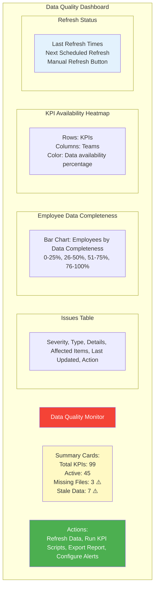

---

## 9.   # Percentage - already at team level, no aggregation
        value = valid_values[0] if valid_values else None
        return {
            'value': value,
            'available_count': len(valid_values),
            'total_count': len(individual_values),
            'has_missing': value is None
        }
    
    elif aggregation_type == 'NA':
        # No aggregation
        return {
            'value': None,
            'available_count': 0,
            'total_count': 0,
            'has_missing': False,
            'note': 'No aggregation for this KPI type'
        }
    
    return {
        'value': 0,
        'available_count': 0,
        'total_count': 0,
        'has_missing': True
    }
```

---

## 8. Implementation Phases

### Phase 1: Foundation (Weeks 1-2)
- [ ] Set up development environment
- [ ] Initialize React + TypeScript + Vite project
- [ ] Set up FastAPI backend structure
- [ ] Database schema creation
- [ ] Data migration scripts (CSV to PostgreSQL)
- [ ] Basic authentication setup

### Phase 2: Core API Development (Weeks 3-4)
- [ ] Implement KPI data endpoints with error handling
- [ ] KPI applicability engine (role-based filtering)
- [ ] ROG calculation service with missing data support
- [ ] Aggregation engine with partial data handling
- [ ] Report generation service with color-coding logic
- [ ] **Employee Management API endpoints (CRUD operations)**
- [ ] **Role Management API endpoints (target editing, bulk operations)**
- [ ] **CSV validation and import service (Resources & Roles)**
- [ ] **Role lookup from Roles.csv**
- [ ] **Impact analysis service for target changes**
- [ ] **Audit trail logging for employee and role changes**
- [ ] Employee and team endpoints
- [ ] Data quality monitoring service
- [ ] API documentation

### Phase 3: Frontend - Basic Views (Weeks 5-6)
- [ ] Dashboard layout and navigation
- [ ] Employee directory page
- [ ] Individual dashboard page
- [ ] Basic data grid components

### PhCSV data loader with pandas
- [ ] In-memory caching strategy
- [ ] ROG status visualizations
- [ ] Goal type grouping
- [ ] Drill-down functionality
- [ ] Charts and gauges

### Phase 5: Configuration Pages (Weeks 9-10)
- [ ] Data quality dashboard (admin)
- [ ] Missing data configuration
- [ ] Target configuration page
- [ ] KPI selection page
- [ ] **Employee Management UI (Admin)**
- [ ] **Add/Edit employee dialog with role dropdowns from Roles.csv**
- [ ] **Bulk import with preview and validation**
- [ ] **Template download and export functionality**
- [ ] **Audit trail viewer for employee changes**
- [ ] **Role Management UI (Admin)**
- [ ] **Inline target editing in data grid**
- [ ] **Bulk target update dialog (multi-select, scale, copy)**
- [ ] **Impact analysis preview before saving targets**
- [ ] **Role CSV import with validation**
- [ ] **Audit trail viewer for role/target changes**
- [ ] Bulk edit capabilities
- [ ] Import/export functionality

### Phase 6: Polish & Testing (Weeks 11-12)
- [ ] Responsive design
- [ ] Performance optimization
- [ ] PDF export functionality testing
- [ ] Data retention cleanup script
- [ ] Unit and integration tests
- [ ] User acceptance testing
- [ ] Documentation

### Phase 7: Deployment (Week 13)
- [ ] Docker containerization
- [ ] CI/CD pipeline setup
- [ ] Production deployment
- [ ] Monitoring and logging

---

## 9. Color Scheme & Design Tokens

### 9.1 ROG Status Colors

```css
--color-green: #66BB6A;      /* Success, met target */
--color-orange: #FFA726;     /* Warning, close to target */
--color-red: #EF5350;        /* Alert, below target */
--color-neutral: #9E9E9E;    /* No data or NA */
```

### 9.2 Goal Type Colors

```css
--color-input: #4CAF50;      /* Input KPIs */
--color-output: #2196F3;     /* Output KPIs */
--color-quality: #9C27B0;    /* Quality KPIs */
--color-hygiene: #FF9800;    /* Hygiene KPIs */
```

### 9.3 Theme Colors

```css
--primary: #1976D2;          /* Primary blue */
--secondary: #424242;        /* Dark gray */
--background: #FAFAFA;       /* Light gray background */
--surface: #FFFFFF;          /* White cards/surfaces */
--text-primary: #212121;     /* Dark text */
--text-secondary: #757575;   /* Gray text */
```

---

## 10. Security Considerations

### 10.1 Authentication & Authorization
- JWT-based authentication
- Role-based access control (RBAC) (no separate mobile view needed)
- **Last updated indicator:** Show timestamp of data freshness
- **No offline support:** Requires internet connection (future enhancement if needed)
- **Role-based KPI display:** Automatically shows relevant KPIs based on employee roles
- **No notifications:** No push notifications or email alerts
- **No customization UI:** KPIs auto-selected by role, no manual selection needed
  - Employee: View own dashboard only
  - Read-only: View aggregate data only
- Manager access determined by reporting hierarchy in Resources.csv
- Subordinate calculation: Recursive traversal of Manager-SAPID relationships

### 10.2 Data Privacy
- Sensitive employee data encrypted at rest
- HTTPS for all communications
- Audit logging for all configuration changes
- Data retention policies

### 10.3 Input Validation
- API input validation with Pydantic
- **Manual refresh:** Refresh button with loading indicator
- **Responsive design:** Mobile-friendly without native app
- **Last updated indicator:** Show timestamp of data freshness
- **No offline support:** Requires internet connection (future enhancement if needed)d queries)
- XSS prevention (React's built-in escaping)
- CSRF protection

---

## 11. Performance Optimization

### 11.1 Backend
- Database indexing on frequently queried fields (sapid, kpi_id, date)
- Query optimization for aggregations
- Caching layer (Redis) for frequently accessed data
- Pagination for large datasets

### 11.2 Frontend
- Code splitting and lazy loading
- Virtual scrolling for large data grids
- Memoization of expensive calculations
- Debouncing of search and filter inputs
- **Manual refresh:** Refresh button with loading indicator
- **Responsive design:** Mobile-friendly without native app
- **Last updated indicator:** Show timestamp of data freshness
- **No offline support:** Requires internet connection (future enhancement if needed)

---

## 12. Monitoring & Observability

### 12.1 Application Metrics
- API response times
- Error rates
- Active users
- Database query performance
- CSV file reload frequency
- Data freshness metrics
- Pagination for large datasets
- Use pandas optimizations (query, groupby, merge)

### 12.2 Business Metrics
- Most viewed KPIs
- Dashboard usage patterns
- Configuration change frequency
- ROG status distribution

### 12.3 Tools
- **Prometheus:** Metrics collection
- **Grafana:** Visualization
- **Sentry:** Error tracking
- **Nginx access logs:** Traffic analysis

---

## 13. Sample Data Examples

### 13.1 Example Employee: Mugilraj Chinnaraj

**Profile:**
- SAPID: 51337592
- Team: DCEM
- Scrum: Team DCEM
- Primary Role: Feature Owner
- Secondary Role: Security Engineer

**Applicable KPIs (Sample):**
- k3: Feature Implementation - Story Points (Output, ANG)
- k12: Code Review (Hygiene, ANG)
- k38: Security issues in product (Quality, ANL)
- k5: Learning Curve (Input, ANG)

**Q1 2026 Data:**
- k3: 82 story points (Target: 45) - **Green** ✓
- k12: 0 reviews (Target: 12.5) - **Red** ✗
- k38: 2 security issues (Target: 6) - **Green** ✓
- k5: 1 training (Target: 6.25) - **Orange** ~

**Goal Type ROG:**
- Input: Orange (1 orange)
- Output: Green (1 green)
- Quality: Green (1 green)
- Hygiene: Red (1 red)

**Overall Status: Orange**

### 13.2 Example Team: OOSM

**Team Composition:**
- 15 members
- Scrums: Team DCO, Team DevOps
- Roles: Developers, QA Engineers, DevOps Engineers, Tech Leads

**Aggregated Q1 2026 (Sample KPIs):**
- k3 (Story Points): 450 actual / 675 target = **Orange** (67%)
- k12 (Code Reviews): 200 actual / 187.5 target = **Green** (107%)
- k9 (Bug Cycle Time): 8 days / 10 days target = **Green**
- k14 (Sprint Planning): 15 delayed SP / 20 target = **Green**

**Team Goal Type ROG:**
- Input: Green
- Output: Orange
- Quality: Green
- Hygiene: Orange

**Team Overall Status: Green**

---

## 14. Open Questions & Decisions Needed

### 14.1 Technical Decisions
- [x] ~~Should we use real-time updates (WebSocket) or polling?~~ **DECISION: No real-time updates. Use polling/on-demand refresh.**
- [x] ~~What's the data refresh frequency?~~ **DECISION: Mixed frequency - Some KPIs hourly, others daily. Backend will poll CSV files based on last modified time.**
- [x] ~~Do we need offline capability?~~ **DECISION: No offline capability needed.**
- [x] ~~Should we support mobile app (React Native)?~~ **DECISION: Not for now. Focus on responsive web design first.**

### 14.2 Business Logic
- [x] ~~Confirm the ROG thresholds~~ **DECISION: Red ≤40%, Orange 40-62%, Green ≥62%. Make thresholds configurable.**
- [x] ~~Confirm the Goal Type ROG aggregation logic~~ **DECISION: Approved as designed.**
- [x] ~~Should managers see all subordinates or only direct reports?~~ **DECISION: All subordinates (full hierarchy).**
- [x] ~~What happens when an employee changes teams mid-period?~~ **DECISION: Use current team assignment. Historical snapshots will be addressed in future enhancement.**

### 14.3 Data Management
- [x] ~~How long should we retain historical data?~~ **DECISION: 1 year + 3 months (15 months total) to allow annual assessment with buffer.**
- [x] ~~Should we support data export?~~ **DECISION: Yes, PDF and Excel export of reports and dashboards. Excel includes conditional formatting (color-coded cells).**
- [x] ~~Do we need data backup and disaster recovery?~~ **DECISION: Not for now. Will be addressed in future phase.**
- [x] ~~How do we handle missing KPI data?~~ **DECISION: Treat as green (neutral/favorable status). Don't penalize for missing data.**

### 14.4 User Experience
- [x] ~~Should we send notifications for ROG status changes?~~ **DECISION: No notifications for now.**
- [x] ~~Do we need email reports?~~ **DECISION: No email reports for now.**
- [x] ~~Should there be a mobile-optimized view?~~ **DECISION: No. Responsive web design is sufficient.**
- [x] ~~Do we need dashboard customization per user?~~ **DECISION: No explicit customization needed. KPIs automatically differ based on user's Primary Role and Secondary Role from Resources.csv matching to Roles.csv.**

### 14.5 Missing Data Handling
- [x] ~~What's the minimum data threshold for team ROG calculation?~~ **DECISION: 50% minimum. If less than 50% data available, treat team as green.**
- [x] ~~Should we alert employees when their data is missing?~~ **DECISION: No employee alerts. Admin-only notifications.**
- [x] ~~How often should we check for missing KPI files?~~ **DECISION: Daily check during scheduled refresh.**
- [x] ~~Should missing data affect manager dashboards/reports?~~ **DECISION: Show as green but with indicator (*) to show it's due to missing data.**
- [x] ~~Do we need automated KPI script execution on data gaps?~~ **DECISION: Not for now. Manual execution only. Future enhancement.**

---

## 15. Next Steps

1. **Review & Approval:** Stakeholder review of this design document
2. **Refinement:** Address open questions and finalize decisions
3. **Prototyping:** Create clickable prototype (Figma or working MVP)
4. **Technical Spike:** Test Apache ECharts with real data, validate FastAPI performance
5. **Go/No-Go Decision:** Approve budget, timeline, and resources
6. **Implementation:** Begin Phase 1 development

---

## 16. Appendix

### 16.1 Technology Alternatives Considered

| Category | Selected | Alternatives Considered | Decision Rationale |
|----------|----------|------------------------|-------------------|
| Frontend Framework | React | Vue.js, Angular, Svelte | Industry standard, large ecosystem |
| UI Library | Material-UI | Ant Design, Chakra UI, Bootstrap | Professional, comprehensive, MIT license |
| Charts | Apache ECharts | Chart.js, D3.js, Highcharts | Performance, rich features, MIT license |
| Backend | FastAPI | Flask, Django, Express.js | High performance, async, auto docs |
| Data Storage | CSV Files | PostgreSQL, MySQL, MongoDB, SQLite | Already in use, simple, no overhead |
| Refresh Strategy | Polling + File Watch | WebSocket, Server-Sent Events | Simpler, matches data update frequency |
| Mobile Support | Responsive Web | React Native, Flutter, PWA | Cost-effective, single codebase |
| Notifications | None | Email, Push, SMS | Not needed initially |
| Reporting | Excel + PDF Export | Email Reports, BI Tools | Interactive reports with formatting |

### 16.2 Useful Resources

- **React:** https://react.dev/
- **Material-UI:** https://mui.com/
- **Apache ECharts:** https://echarts.apache.org/
- **FastAPI:** https://fastapi.tiangolo.com/
- **PostgreSQL:** https://www.postgresql.org/

### 16.3 Estimated Costs (Open Source = Free)

- **Development Tools:** $0machine, no database needed)
  - Production: ~$20-50/month (lightweight cloud hosting, no DB costs)
- **Storage:** CSV files are minimal (existing ~10-50MB)
- **Development Effort:** ~10-12 weeks (1-2 developers, simpler without DB
  - Production: ~$50-200/month (cloud hosting)
- **Development Effort:** ~13 weeks (1-2 developers)

---

## Document Control

- **Version:** 1.0
- **Date:** March 7, 2026
- **Author:** Dashboard Design Team
- **Status:** Draft - Pending Review
- **Next Review:** March 14, 2026

---

**End of Design Document**
